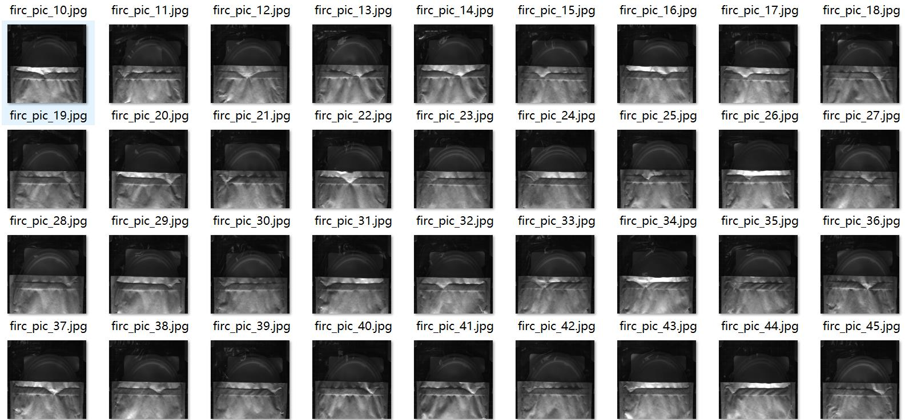
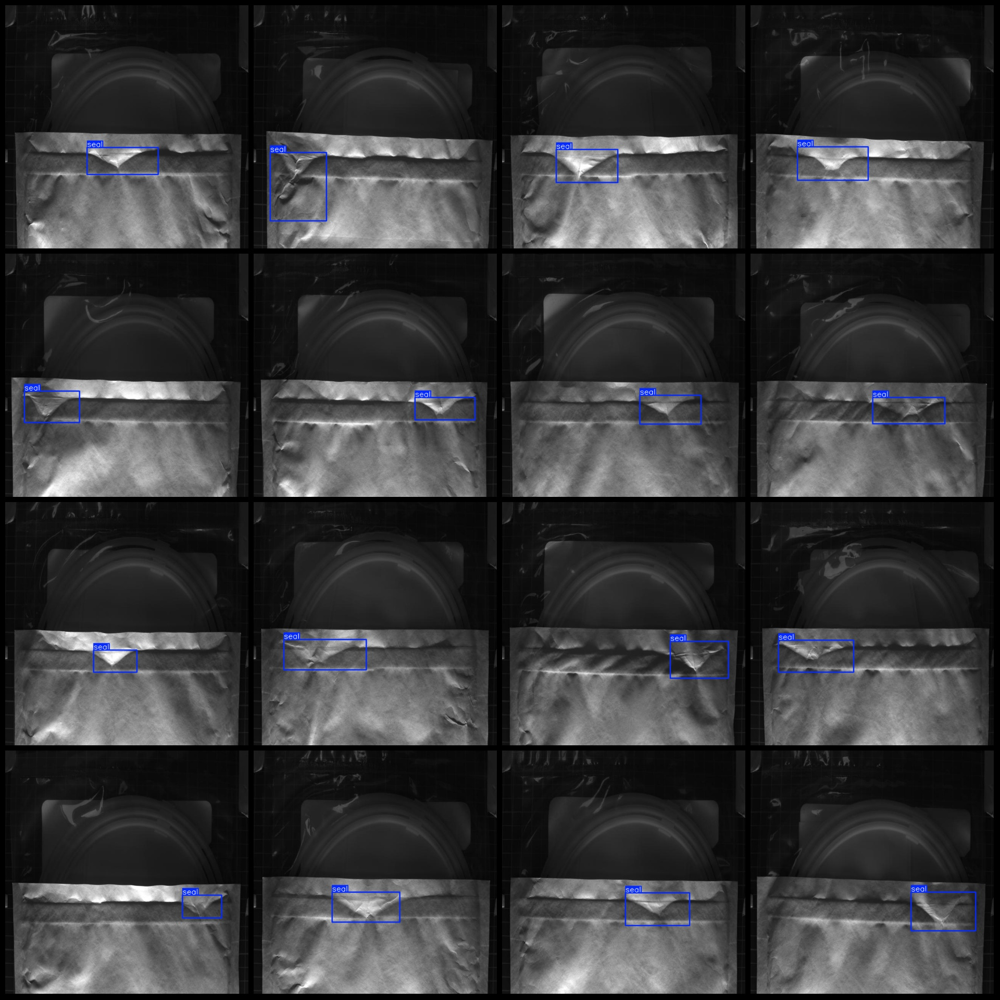
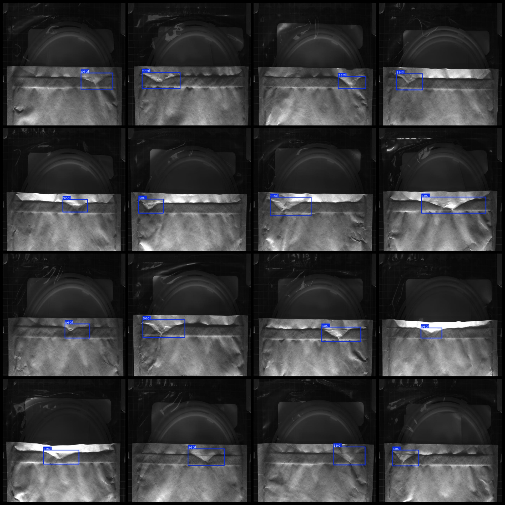

# Packaging Bag Sealing Detection Dataset - VOC+YOLO Format, 101 Categories

Dataset format: Pascal VOC format + YOLO format (txt file without split path, only containing jpg images and corresponding VOC format xml files and yolo format txt files)
Number of image files (jpg): 101
Number of annotation files (xml): 101
Number of annotation files (txt): 101
Number of categories: 1
Annotation category name: ["seal"]
Number of bounding box per category: 101
Total number of bounding boxes: 101
Number of images each category occupies: 101
Image resolution: 640x640
Annotation tool used: labelImg
Annotation rules: draw a rectangle box around the category
Important note: The dataset does not have separate training/validation/test sets to be divided.
Special declaration: This dataset does not guarantee the accuracy of the trained model or weight files.
Image preview:
Annotation example:

## Image

Here is a pay link on Stripe ( https://buy.stripe.com/3cs8yP7sY87d0vu9AB ). Please contact me lonlonago@foxmail.com after funding $89, and I will send you a complete data files , thank you!

